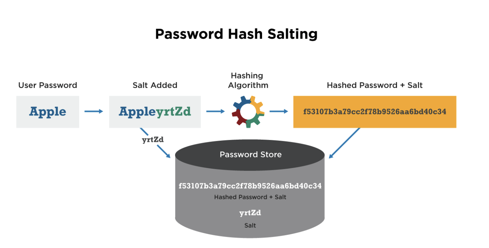
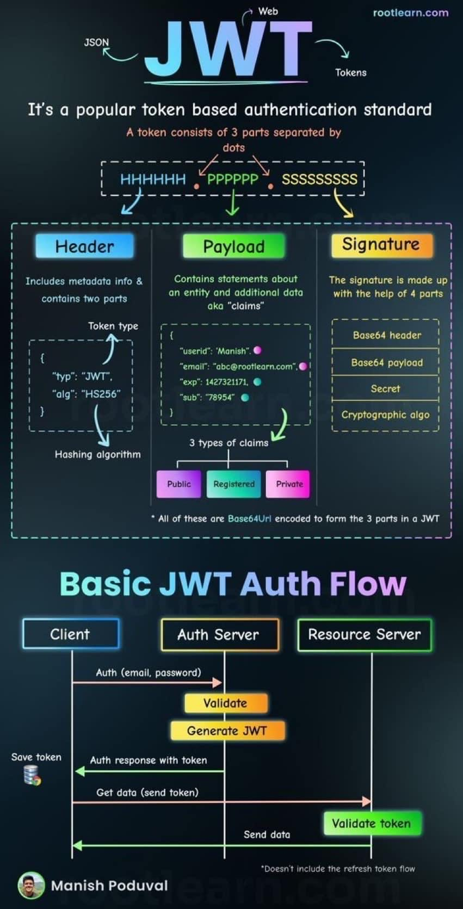
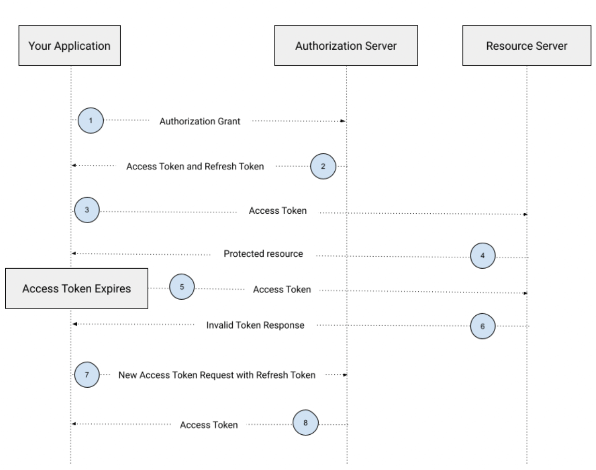

# :pushpin: Outline
### (For only basic NodeJS project. We will build another complete project in the future)
1. Password Salting & Encryption
2. JWT concept & Access/Refresh Token
3. RBAC concept & implementation via middleware

# Download Packages
1. mysql2 (for connection pooling)
2. bcrypt
3. jsonwebtoken

# :pencil: Explaination
## Password Hash Salting
* Password salting involves adding random data to a password before hashing it. <u>The random data is called a salt</u>
* Salting makes the attacker cannot directly use the precomputed hash tables(rainbow table) to crack password because the salt makes each hash unique.
* Involves adding salt and hashing

## Hashing
* <u>One-way process(irreversible)</u> that converts plaintext into a fixed-length string of characters (the hash)
* With a hash function (e.g. MD5, SHA1, SHA256, bcrypt)
* Same input will always produce the same output (so rainbow table is computed)

## Slow Hashing (e.g. Bcrypt)
* Slow hashing is a technique used to make password hashing computationally expensive and time-consuming
* The idea behind slow hashing is to intentionally slow down the hash function used for password hashing, by adding a computationally intensive step or a delay factor, such as <u>multiple rounds of hashing</u>.
* We will use Bcrypt: 
    * Bcrypt is a password-hashing function that is designed to be <u>slow and computationally expensive</u>. 
    * This makes it resistant to brute-force attacks and makes it more difficult for attackers to crack passwords.

## How to compare password?
* Compare the hashed values to authenticate users without the need to store the plaintext password itself.

</img>

---
## Authentication & Authorization
### Authentication
* Authentication is the process of verifying a user's identification through the acquisition of credentials and using those credentials to confirm the user's identity. 
* The authorization process begins if the credentials are legitimate. 
* The authorization process always follows the authentication procedure.

### Authorization
* Authorization is the process of allowing authenticated users access to resources by determining whether they have system access permissions. 
* By giving or denying specific licenses to an authenticated user, authorization enables you to control access privileges.

---

## JWT (JSON Web Token)
* [Why JWT?](https://easonchang0115.github.io/blogs/backEnd/2020/20200317_1.html#server-%E7%9A%84-cookie)
* JWTs can be used to authenticate and authorize users and securely transmit information between parties.
* A JWT is made up of <u>three parts: a header, a payload, and a signature.</u> </br>
Here's an example JWT: </br>
```
eyJhbGciOiJIUzI1NiIsInR5cCI6IkpXVCJ9.
eyJzdWIiOiIxMjM0NTY3ODkwIiwibmFtZSI6IkpvaG4gRG9lIiwiaWF0IjoxNTE2MjM5MDIyfQ.
SflKxwRJSMeKKF2QT4fwpMeJf36POk6yJV_adQssw5c
```
* The header contains metadata about the JWT, such as the algorithm used to sign the token. 
* The payload contains the actual data being transmitted, such as user ID, username, or email address. (<u>We don't store sensitive information here.</u>)
* The signature is used to verify the integrity of the JWT and ensure that the token has not been tampered with.

**The structure of JWT and the transmit flow are shown below.**

</img>

## Verify Token (using middleware)
* We will use NodeJS middleware to do authentication (verify token before API action)
* Middleware:
  * Middleware is software that sits between different components of a system and facilitates communication and data exchange between them.
  * In Node.js, middleware refers to functions that are executed in the middle of the request-response cycle.

## AccessToken and RefreshToken
### AccessToken
* <u>An access token is a type of token that is used to grant access to a protected resource, such as an API endpoint or a web page.</u>
* Access tokens are typically short-lived, meaning that they expire after a certain amount of time (e.g., 1 hour).

### RefreshToken
* <u>A refresh token is a type of token that is used to obtain a new access token after the original access token has expired.</u>
* Refresh tokens are typically long-lived, meaning that they can be used to obtain new access tokens for an extended period of time (e.g., 30 days).

## Refresh Token Action

**The flow of using AccessToken and RefreshToken is shown below:**

</img>

---

# :books: Resources
* [mysql2](https://openbase.com/js/mysql2)
* [Bcrypt tutorial](https://blog.logrocket.com/password-hashing-node-js-bcrypt/)
* [JWT website](https://jwt.io/)
* [NodeJS JWT tutorial](https://www.section.io/engineering-education/how-to-build-authentication-api-with-jwt-token-in-nodejs/)
