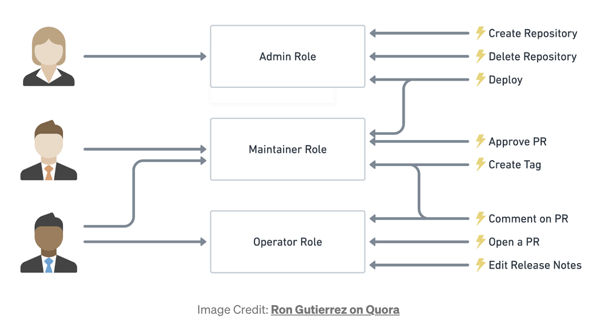

# :pushpin: Outline
* RBAC
* Basic Frontend and connected with backend

# Download Packages
* cors

# :pencil: Explaination
## CORS
CORS stands for Cross-Origin Resource Sharing. It is a security feature implemented by web browsers to control access to resources (such as web pages, scripts, or images) across different domains.

---

## RBAC (Role-Based Access Control)
* RBAC is a security model used to manage access to resources
* In RBAC, access control is based on the roles.
* A role is a collection of permissions that define what actions a user can perform. For example, a role may define permissions to read or modify files, create new accounts, or change system settings.
* There are 4 main RBAC model
  * **RBAC0 — Core RBAC (We will use this)**
  * RBAC1 — Hierarchal RBAC (RBAC0 + role hierarchies)
  * RBAC2 — Constraint RBAC (RBAC0 + Constraints)
  * RBAC3 — Combines RBAC (RBAC1 + RBAC 2)
  * The process of RBAC authorization can be abstracted as
    * Who — User or role of the permission
    * What — Resource
    * How — Specific permission
  * </img>
### RBAC0
* 3 elements: Users, roles, and permissions
* The design is based on the "many-to-many" relationship, that is, multiple users can have the same role, and one user can have multiple roles.
### RBAC1
* 4 elements: Users, roles, permissions, Hierarchy/Inheritance
### RBAC2
* 4 elements: Users, roles, permissions, and constraints
### RBAC3
* It integrates all the characteristics of RBAC1 and RBAC2 (role inheritance and constraint relationship) into the model.

---

# :books: Resources
* [RBAC model](https://medium.com/geekculture/role-based-access-control-rbac-model-7d8e7b7350d2)